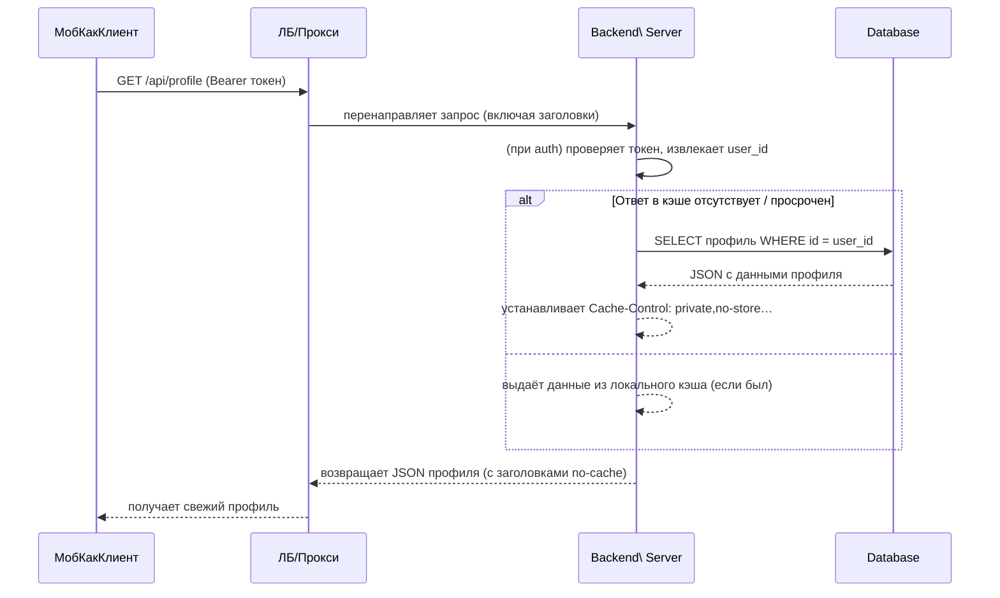

# Краткое резюме  
Тестировщики сообщают, что после регистрации в приложении они «видят чужой профиль» – вместо своего в API возвращается данные другого пользователя. Вероятные причины – **ошибки кэширования** (на клиенте, в прокси/CDN или на сервере), **неправильная работа сессий/токенов** или **состояния клиента**. Например, если сервер возвращает персонализированные данные с заголовками `Cache-Control: public` или без `private/no-store`, кэш (на устройстве или в CDN) может отдать старую информацию другому пользователю【54†L156-L164】【75†L72-L80】. Точно так же, если клиентский код неверно сбрасывает состояние при выходе или при обновлении токена, могут использоваться данные предыдущего пользователя. В некоторых случаях проблемы дают и **нейтворк-прокси** (NGINX, load balancer) или **sticky sessions**: отсутствие правильно настроенной привязки сессии на разных узлах может привести к “перескакиванию” сессии между пользователями.  

**Ключевые шаги решения:** на сервере явно запрещаем кэширование персональных данных (`Cache-Control: private, no-store`), отключаем ETag для динамичного контента【73†L417-L425】. На клиенте проверяем, что при выходе из аккаунта состояние и токен сбрасываются, а запросы на профиль всегда посылаются с корректным заголовком авторизации (и, при необходимости, с `Cache-Control: no-cache`). Добавляем логирование `user_id` и `request_id` в каждое обращение к API профиля для отладки. Далее приводится сравнительная таблица гипотез, план отладки, конкретные патчи и тесты. 

## Возможные причины  
- **HTTP-кэширование:** Сервер может возвращать ответ профиля с заголовками, разрешающими кэширование (`public, max-age=…`)【75†L72-L80】. В этом случае HTTP-кэш на устройстве или в промежуточном прокси будет отдавать старые данные – и другие пользователи увидят чужую информацию. React Native (Expo) использует `NSURLSession`/`OkHttp`, которые уважают заголовки `Cache-Control`【54†L156-L164】. Если ответы на GET `/profile` выдаются «как есть», RN может кешировать их, и при следующем запросе (даже с другим токеном) вернуть старый ответ.  

- **CDN/прокси (сaches):** Если приложение за прокси (NGINX, CDN вроде Cloudflare), неправильные настройки `Cache-Control` или `Vary` могут позволить кэшировать персональные данные на уровне сети. Например, пропуск `Authorization` в списке `Vary` приведет к выдаче кэшированного профиля не тому пользователю.  

- **Сессии/токены:** Если используется cookie-сессия, неправильные настройки домена/путя могут объединять разные логины в одном cookie. За балансировщиком без sticky-session сессии могут «перескакивать». При использовании JWT – возможны ошибки в обновлении токена (например, при refresh токен подставляет не того пользователя, или токен на клиенте не перезаписывается после выхода).  

- **Код клиента (React Native/Expo):** Ошибка в логике работы с состоянием. Например, после выхода из аккаунта не очищается контекст пользователя; при быстрой навигации может отработать несколько асинхронных запросов к API профиля, и в состояние попадёт ответ от старого пользователя (race condition). Неправильное переиспользование состояний («reassign state») или старыми ссылками на данные – приводят к тому, что UI показывает невалидный профиль.  

- **Код сервера:** Ошибка маршрутизации или кэширования. К примеру, для оптимизации могли добавлять глобальный middleware, возвращающий один и тот же «образец» профиля; или использовать глобальные переменные для хранения последнего запроса. Если на сервере включен `express.static` или `etag`, это тоже может приводить к некорректному кэшированию динамического контента【73†L417-L425】.  

- **Авторизация/обновление токена:** Некорректная работа Refresh Token flow: при истечении сессии новый токен может привязаться к другому пользователю (например, из-за ошибки в коде обновления). Ошибка в ограничении области (`scope`) cookie или неправильный domain в cookie может сделать куки общими для нескольких аккаунтов.  

- **Sticky sessions/Load Balancer:** Если задействован балансировщик без sticky-session (привязки клиентов к серверу), один пользователь может начать сессию на одном инстансе, а при следующем запросе попадёт на другой, где память/сессия другая. Это может вызвать смену видимого профиля.  

Каждая причина требует своей области поиска: где в коде (сервере или клиенте) проверять логику, какие логи добавить, какие тесты прогонять. 

| Гипотеза                         | Вероятность | Признаки                                 | Как проверить                                                 | Пример исправления                                              |
|----------------------------------|------------|------------------------------------------|--------------------------------------------------------------|-----------------------------------------------------------------|
| **Клиентское HTTP-кэширование**  | Высокая    | После открытия приложения или обновления экрана профиль не изменяется; в ответе на запросы заголовок `Age`/кэширования | Сравнить HTTP-заголовки ответа (Cache-Control); добавить в запрос `no-cache`; в emulatore/devtools смотреть Network  | Добавить в ответ на `/profile` заголовок `Cache-Control: private, no-store, must-revalidate` (либо на клиенте при fetch – `Cache-Control: no-cache`); отключить префетчинг |
| **Прокси/CDN кэширование**       | Средняя    | В пром.прокси (NGINX/CloudFlare) логи записи профиля для разных userId одинаковы; тест: отключение кэша (простое правило) меняет поведение | Просмотреть конфигурацию прокси/CDN (cache rules); сделать прямой запрос (обход прокси); анализировать логи сервера, есть ли повтор ответов для разных токенов | В настройках прокси добавить заголовок `Cache-Control` или `Vary: Authorization`; отключить кэш для API (настройка `location` в NGINX или правило в Cloudflare) |
| **Ошибка сессии/токена**         | Средняя    | Пользовательский ID (`user_id`) в токене/сессии одинаков для разных логинов; возможно, при старте приложения сразу видно чужой профиль | В логах сервера добавить запись (req.user.id); при последовательных логинах убедиться, что токен меняется; проверить cookie (интерсептором) | Убедиться, что при логауте удаляется локальный токен и очищаются куки; проверить, что новый логин выдаёт новый уникальный токен; использовать отдельный ключ для сеансов каждого окружения |
| **Баг клиентского кода**         | Низкая     | Логика установки/сброса state не вызывается (нет .reset(), .replace()); при переключении пользователей экран не рендерится заново, либо перезаписывается прошлый state | Просмотреть код компонентов профиля/авторизации; добавить `console.log` на загрузку профиля; протестировать в разных flow (logout→login, переходы) | После логаута дополнительно сбросить Context/UserStore, перезагрузить корневой Navigator; в fetch-функции проверить актуальность токена перед запросом и использовать ключ в AsyncStorage, сбрасывать старые данные |
| **Серверный кэш или глобальные данные** | Низкая     | В коде используются глобальные переменные, например `lastProfile`; или middleware кэширует endpoint `/profile` | Найти в коде (или middleware) вызовы `etag`, `app.use(express.static)`, кэширующие конфиги; добавить логирование входа/выхода в handler профиля | Удалить или ограничить `app.use(express.static)` (снова: статик не должен обслуживать API); вызвать `app.set('etag', false)` и middleware со сбросом кэша при авторизации (см. ниже) |
| **Sticky sessions/Load Balancer**| Низкая     | Поведение наблюдается только на продакшене с LB; логи приложений разных инстансов показывают разные `user_id` при запросе одного токена | Проверить настройки load balancer на включение stickiness; через инструменты мониторинга следить за Server-ID для запросов одного пользователя | Включить sticky-session или распределённое хранилище сессий (Redis); при использовании JWT убедиться, что нет зависимости от локального хранилища в памяти |

## План отладки  
1. **Логирование** – добавить вывод `user_id`, `request_id`, `Authorization`-заголовка и тела ответа при вызове API профиля. Это покажет, какой пользователь сервер реально видит при запросе.  
2. **Проверка запросов** – с помощью `curl` или `httpie` эмулировать два разных пользователя. Например:  
   ```
   TOKEN1=$(curl -XPOST https://api.unqx.uz/login -d '{"email":"u1","pass":"..." }' | jq -r .token)  
   curl -H "Authorization: Bearer $TOKEN1" https://api.unqx.uz/profile -v
   ```  
   Затем – для второго пользователя, сравнить ответы. Если при запросе с новым токеном сервер всё ещё возвращает первый профиль, проблема явно в кэшировании или серверной логике.  
3. **Анализ кэширования HTTP** – убедиться, какие заголовки возвращает сервер. Например, `curl -I https://api.unqx.uz/profile -H "Authorization: Bearer $TOKEN1"` покажет `Cache-Control`, `ETag`, `Expires`. Если в них нет явного `no-store/private`, можно принудительно указать в запросе `Cache-Control: no-cache` и повторить – изменения в результате укажут на кэш.  
4. **Симуляция «многопользовательского сценария»** – настроить два эмулятора/устройства или использовать Postman Runner с разными учётками одновременно. Смотреть, не возникает ли «перескакивания» профилей при одновременных запросах под разными токенами.  
5. **Подключение прокси** – при необходимости поднять временный прокси (ngrok / локальный NGINX) и пропустить запросы через него с логированием, чтобы убедиться, что проблема не в CDN (например, во время разработки).  
6. **Логи мобильного клиента** – если React Native, посмотреть через `adb logcat` (Android) или консоль Xcode (iOS) – не появляется ли там сообщение об ошибках запроса (например, 304 Not Modified), или обрабатывается ли ответ корректно в коде.  
7. **Тесты нагрузки (по необходимости)** – написать unit-тесты/скрипты, которые многократно делают последовательные запросы логин→профиль для разных учёток, чтобы убедиться, что проблема стабильна. 

## Ориентированные исправления  
- **Заголовки HTTP-кэша:** На сервере (Express) в middleware для API профиля или глобально для всех защищённых маршрутов установить заголовки, запрещающие кэширование персональных данных. Например:  
  ```js
  app.use('/api', authMiddleware, (req, res, next) => {
    // Запретить кэширование
    res.setHeader('Cache-Control', 'private, no-store, no-cache, must-revalidate, proxy-revalidate');
    res.setHeader('Pragma', 'no-cache');
    res.setHeader('Expires', '0');
    next();
  });
  ```  
  При этом отключить ETag:  
  ```js
  app.set('etag', false);
  ```  
  Это гарантирует, что клиент и прокси всегда будут запрашивать свежие данные【73†L417-L425】【75†L72-L80】.  

- **Исправление клиентов:** В React Native при `fetch` или использовании axios явно указать `Cache-Control: no-cache` для запроса профиля (если библиотека позволяет). Также убедиться, что при логауте удаляются все сохранённые токены и данные профиля в `AsyncStorage`/`Redux`. Пример (fetch):  
  ```js
  fetch('https://api.unqx.uz/profile', {
    headers: {
      'Authorization': `Bearer ${token}`,
      'Cache-Control': 'no-cache'
    }
  })
  .then(res => res.json())
  .then(data => setProfile(data));
  ```  

- **Проверка middleware аутентификации:** Если используется `express-session`, убедиться, что при смене пользователя предыдущий сеанс действительно завершается. Если JWT, то при выдаче нового токена старый удалять из базы (если сохраняется). Проверить, что `cookie.secure` и `sameSite` настроены корректно (например, `SESSION_COOKIE_SECURE=true`, `TRUST_PROXY=true`, чтобы cookie корректно приходил клиенту【27†L143-L152】).  

- **Логи запросов:** Добавить в сервере обработчик ошибок или логгирование, чтобы на каждый запрос профиля выводился `user_id`, присвоенный из токена/сессии, и время. Это облегчит отладку.  

- **Тестовые примеры (Patch):**  
  - *Server-side (Express):*  
    ```diff
    // В src/app.js или аналоге
    app.disable('view cache');
    app.set('etag', false);
    app.use('/api/profile', auth, (req, res, next) => {
      res.set({
        'Cache-Control': 'private, no-store, no-cache, must-revalidate, proxy-revalidate',
        'Pragma': 'no-cache',
        'Expires': '0'
      });
      next();
    });
    ```  
  - *Client-side (React Native):*  
    ```diff
    // В функции загрузки профиля
    fetch(`${API_URL}/profile`, {
-     method: 'GET',
+     method: 'GET',
      headers: {
        'Authorization': `Bearer ${token}`,
+       'Cache-Control': 'no-cache'
      }
    })
    ```  

- **Конфигурация NGINX/CDN:** Если используется NGINX перед приложением, в блоке локации для `/api/` добавить `proxy_cache_bypass $http_authorization;` и `add_header Cache-Control 'no-store';`. В настройках CDN – правило «бypass cache for URLs containing `/api/` или для заголовка Authorization».  

- **Тестирование исправлений:** После внесения изменений воспроизвести шаги из плана (curl, несколько клиентов) – удостовериться, что при запросе второго пользователя ответ уже его, а не закэшированного первого. Временные заголовки `Cache-Control: no-cache` в запросах и `no-store` в ответах должны полностью исключить отдачу чужого профиля【75†L72-L80】【73†L417-L425】. 



## Мониторинг и предотвращение проблем  
- **Логирование `request_id`/`user_id`:** Генерировать уникальный `request_id` на каждый запрос и логировать его вместе с `user_id` и клиентским IP/UUID. Это поможет быстро отличать запросы разных пользователей и трассировать проблему.  
- **Нагрузочное тестирование:** Автоматизировать симуляцию входа под несколькими учётками на CI/CD (например, с помощью `k6` или `JMeter`), проверяя, что каждый получает правильные данные. Добавить такие тесты в pipeline.  
- **CI-checks:** В pipeline предусмотреть проверку отсутствия заголовка `public` или `max-age` в ответах на запросы авторизованных API (например, `curl -D - ...` в тесте).  
- **Мониторинг отклонений:** Настроить APM или логи так, чтобы при первых признаках «утечки данных» (например, если пользователь A явно получает профиль пользователя B) срабатывало уведомление.  
- **Безопасность:** Ограничивать время жизни токенов/сессий. Убедиться, что `session.cookie.secure` и `sameSite` соответствуют рекомендациям (см. конфиг Redis/pool).  

**Заключение.** Наиболее простым и эффективным решением будет отключение кэширования профиля (на уровне HTTP-заголовков) и тщательная проверка токенов. Первичные исправления – это добавить `Cache-Control: private, no-store` на сервере и убедиться, что клиент при логине/логауте правильно обновляет своё состояние. После внесения патчей следует прогнать описанные тесты и убедиться, что повторить ситуацию не удаётся. Источники рекомендуют для динамических персонализированных ответов применять директиву `private` или `no-store`, чтобы не допустить «утечек» между пользователями【75†L72-L80】【73†L417-L425】, а React Native документация подтверждает, что заголовки HTTP влияют на кеширование запросов【54†L156-L164】.